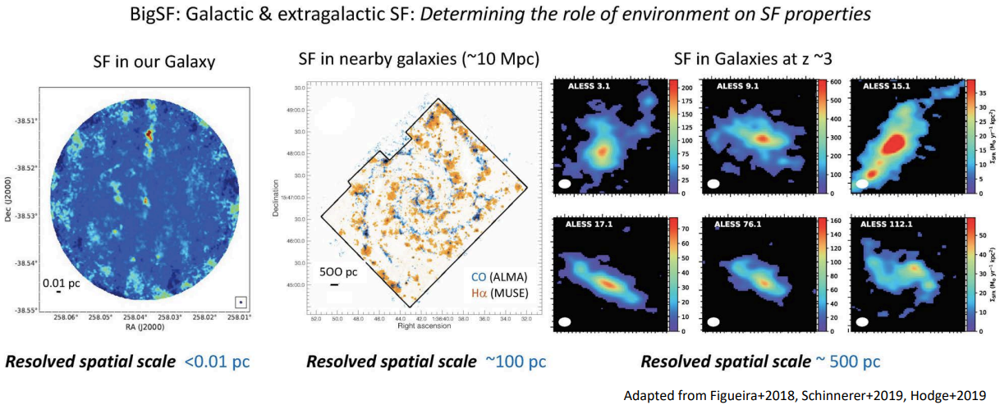
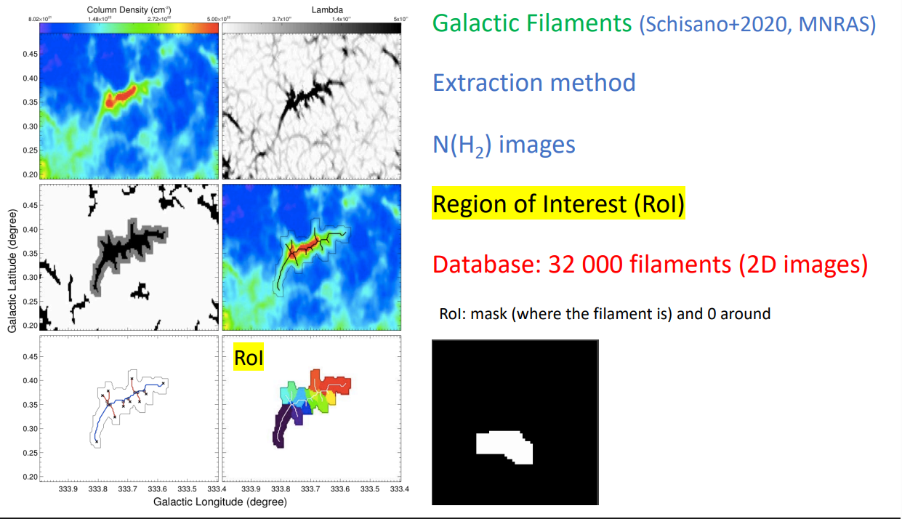
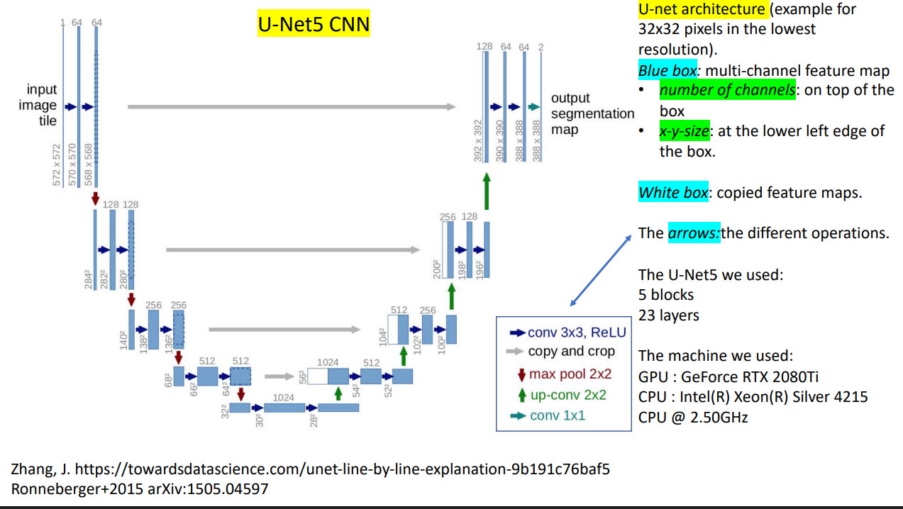

Astrophysics Goals
==================

- Star formation as a fonction of the environment (physical conditions)
- Bridging the gap between Galactic & extragalactic star formation
- Extragalactic SF: Use the built model + change the spatial resolution

.. container::

   How SF depends on the environment in galaxies ?

Galactic & extragalactic star formation
^^^^^^^^^^^^^^^^^^^^^^^^^^^^^^^^^^^^^^^

SF components
^^^^^^^^^^^^^

Filaments, clumps, cores, young stars

2D filament Segmentation
^^^^^^^^^^^^^^^^^^^^^^^^

Method: supervised learning
***************************

- Database : Hi-GAL column density maps: 32 000 filaments + their associated RoI
- Images of different size
- For each filament: 3 patches (64x64) are taken from 3 random positions around the RoI
  - Must contain ≥ 20% of the mask
- Parts with missing data in the original image are not taken (saturation zones)
- Data augmentation: 2 flips and 3 rotations

.. container::

   ~ 900 000 patches + their associated RoI

- U-Net5 Convolutional Neural Network used for image segmentation
- Base: 80% training set and 20% validation set
-  Python + Keras: 20 epochs for the learning phase

