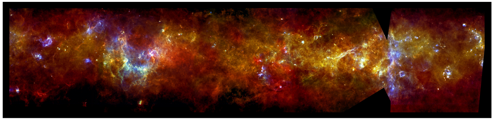

.. ProjectName documentation master file, created by

Welcome to LIS²'s documentation!
=======================================

LIS² (Large Image Split Segmentation): A toolbox for large-scale, single-image semantic segmentation
This is the documentation for LIS², a comprehensive project with various modules and utilities.

   The image combines observations from the PACS and SPIRE instruments on Herschel. It spans about 12 degrees on the longer side, corresponding to some 24 times the diameter of the full Moon. 
   This is 1/30th of the entire Galactic Plane survey. Copyright : ESA/PACS & SPIRE Consortium, S. Molinari, Hi-GAL Project

Contents:

.. toctree::
   :maxdepth: 2
   :caption: Contents:

   Quickstart
   Concepts
   modules/models
   modules/datasets
   data_augmentation
   preprocessing
   controller
   segmenter
   trainer
   training_pipeline
   loss
   optimizer
   scheduler
   early_stop
   trackers
   modules/metrics
   modules/utils

Indices and tables
==================

* :ref:`genindex`
* :ref:`modindex`
* :ref:`search`
